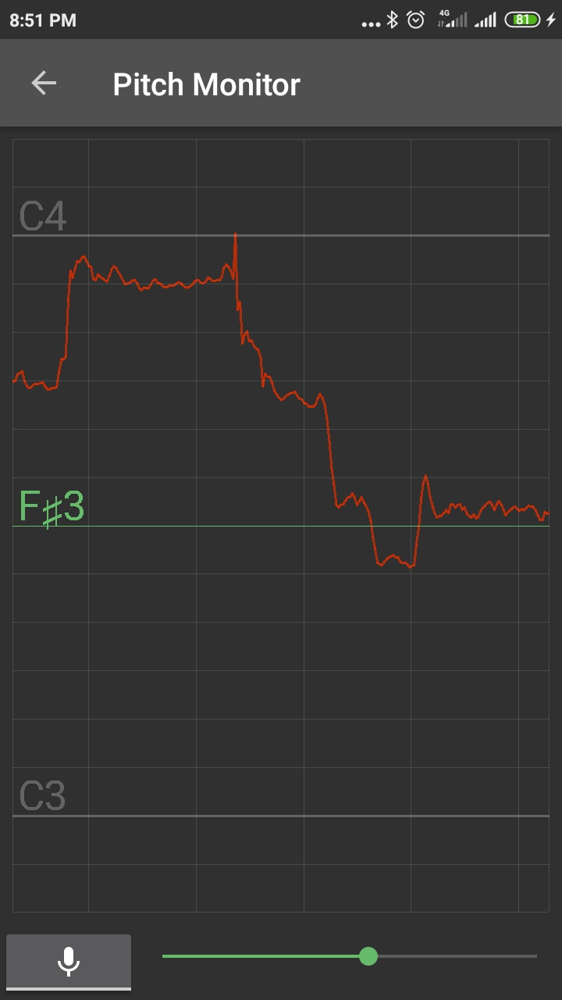

## Pitch Monitor

Recently, I've added a 'Pitch Monitor' tool to the Vocalizzo app. This tool simply shows at real time all the notes
that you're singing and... that's it, it does nothing more. And it is a great tool for any vocalist and I will shortly 
explain what you can do with it.

## How to start it
To start the 'Pitch Monitor' go to the '3 vertical dots' menu (top right corner) on the main Vocalizzo screen and
tap on the 'Pitch Monitor' menu item:

{:height="324px"}.
{:height="324px"}.
{:height="324px"}.

Tap the microphone button and sing something. You will see the visualization of your singing right away, something like this:

{:height="324px"}.

There is a seek bar conrol to the right of the 'microphone' button which could be used to adjust the horizontal scale of Pitch Monitor.

## Vocal siren exercise
Vocal siren is a great warm-up exercise. There are many variations of it. All of them sound like a siren of an emergency vehicle. Pitch Monitor helps you to control the smoothness and range of your sirens.

For example, a siren with a long period. Make an 'e-e-e' or 'o-o-oh' (or any comfortable to you) sound and gradually slide through the notes of about a two-octave range. Slide up and then back down. Here is what I've done:

{:height="324px"}.

A siren with a short time period:

{:height="324px"}.

You may easily find detailed instructions and demos of siren exercises in the Internet. I hope that
Vocalizzo's Pitch Monitor will help you with your vocal training and make it more fun!
